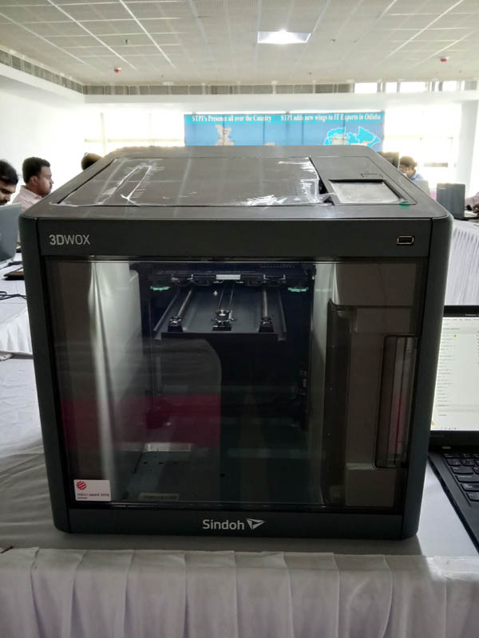
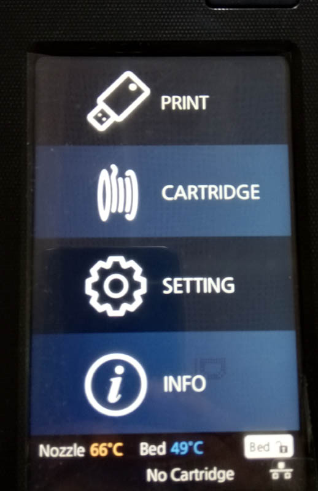
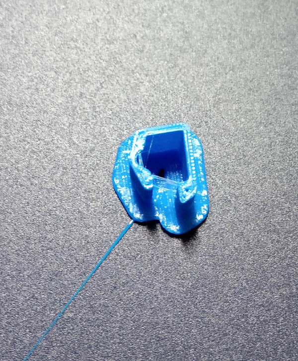

**Working on a 3D Printer for the first time**
Picture of a 3D Printer 3DWOX by Sindoh 200 

This printer uses Polylactic acid filament (PLA) for printing objects with different colours, however only a single colour printing can be done at a time 
The filament is 1.75mm in diameter and a cartridge can hold 700 gram of filament
The filament has to be tightly wound, inside the cartridge.
Filament should be handled with care so as not to stressed or bend it to avoid even slight deformities in the filament, any part with deformities may be cut off before feeding inside the printer. Make sure not to cut off long strips as the sensor attached to the Cartridge will not report the correct length of remaining filament.

The loose ends of the filament should not extrude from the opening of cartridge.

After new filament cartridge is fitted manually inside the printer, the feed new cartridge command can be assessed by selecting the **Cartridge** menu on LCD screen available in the printer 

During change of Cartridge or if the printing stop midway due to any reason,  it is compulsary to heat up the nozzle first to loosen the filament, by using **Extrude** command from the 3DWOX monitor
(As seen in picture)

a few design files for 3D printing are readily available in the website like **thingiverse.com** for testing, we can create our own designs for printing by using free software like **Freecad**, Other softwares are **Tinkercad** for beginner or **Fusion360** for precision design or **Blender 2.8** for organic modeling. They are all Free softwares.

Due to constrain of time, we download a design file for creating a Clip which can be use to prevent unwinding of 1.75mm PLA filament inside the cartridge (while storing).

The printer that we have used is wi fi enabled and the print command can be issued from any pc in the network by using the software provided by the manufacturer or alternatively by transfering the sliced file in G-code format directly to the printer by using a USB memory stick and use the print command from the  menu on the LCD screen of the printer.

**First 3D printed object**
*a filament clip*

The base plate may get heated up by around 60 degree centigrade, so care should be taken while removing it using the Spatula provided for the purpose. 

The base substrade, which was created to hold the object firmly to the base plate had to be removed manually , some bigger designs can be printed without the base.

Also, the debri collection chamber inside the printer need to be emptied on regular intervals.

**Responsibility of the user of Fablab**
To follow all safety instructions 2. At the end of the day, leave the laboratory  and the equipments (clean) just the way you found it 3. To document your experience at the Lab so that others might find it useful.

Designing of new Model and printing to follow soon..

- [Home](readme.md)
- [3D Printer](3DPrinter.md)
- [Vinyl cutter](vin.md)
- [documentation tips](documentation.md)
- [Electronic Design](design.md)