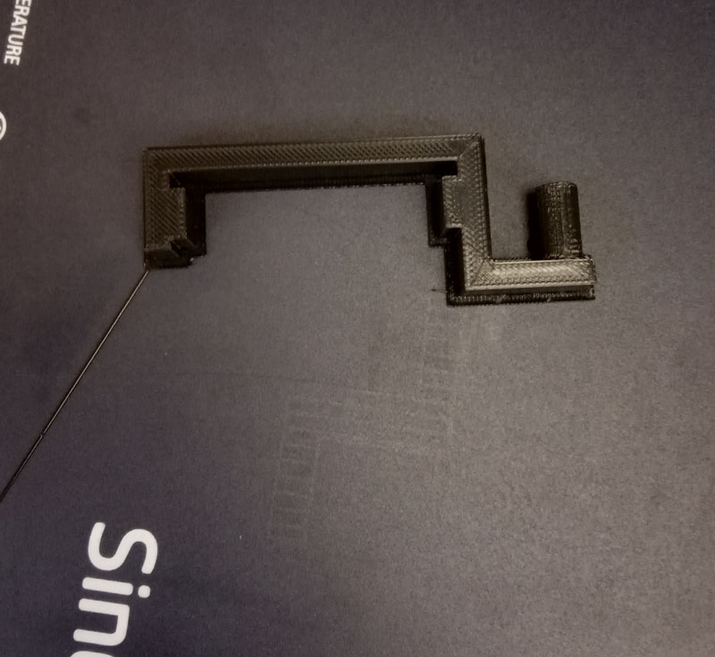
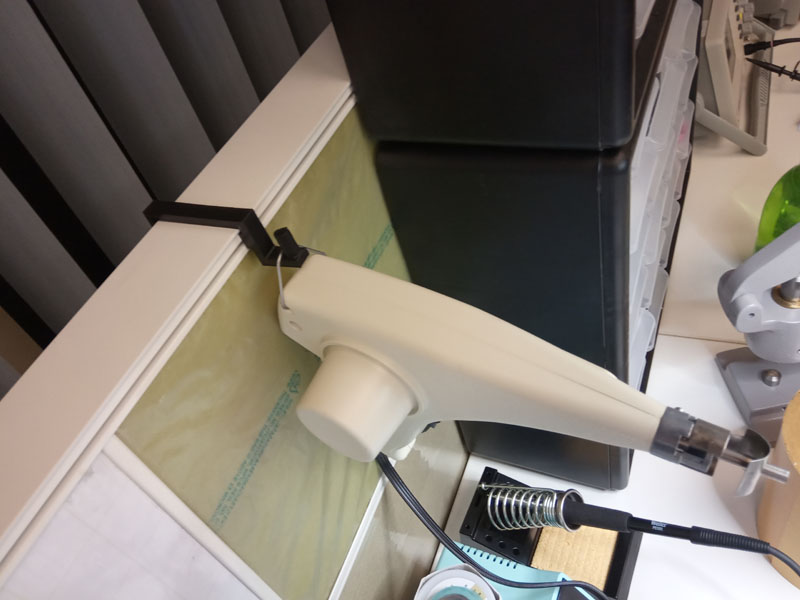

**Working on a 3D Printer for the first time**

Picture of a 3D Printer 3DWOX 200 by Sindoh  

- This printer uses Polylactic acid filament (PLA) , however only a single colour cartridge at a time 
- The filament is 1.75mm in diameter and a cartridge can hold 700 gram of filament
- The filament has to be tightly wound, inside the cartridge.
- during rewinding , if any part of the filament is stressed beyond elastic limit, that part may be cut off before feeding inside the printer. *Make sure not to cut off long strips as the sensor attached to the Cartridge will not report the correct length of remaining filament.*

- While loading the cartridge, the loose ends of the filament should not extrude from the opening of cartridge.

- After new filament cartridge is fitted manually inside the printer, the feed new cartridge command can be assessed by selecting the **Cartridge** menu on LCD screen available in the printer 

- During change of Cartridge or if the printing stop midway due to any error,  nozzle to be heated first to loosen the filament, by using **Extrude** command.
(As seen in picture)

- Design files for 3D printing are  available in the website like **thingiverse.com** ,  create  own designs using free software like **Freecad**,  **Tinkercad** for beginner or **Fusion360** for precision design or **Blender 2.8** for organic modeling. 

- Download a design file for creating a Clip which can be use to prevent unwinding of 1.75mm PLA filament inside the cartridge (during storage or transport). the original sti file can be assessed here [Clip file for 3D print](files/clip.sti)

- Above file converted to gcode for sending to 3DWOX Printer using software provided by manufacturer [clip in gcode](clipgcode.gcode)

The printer is wi fi enabled,  print command can be issued  using the software provided by the manufacturer or,  alternatively by transfering the  G-code file to the printer using a USB memory stick and issue print command from the  menu on the LCD screen.

**First 3D printed object**
*a filament clip*

- The base plate may get heated up by around 60 degree centigrade, better cool down before removing printed object using spatula.

- Some bigger designs can be printed without the base.

- Also, the debri collection chamber inside the printer need to be emptied on regular intervals.

**Responsibility of the user of Fablab**
1) To follow all safety instructions 2. At the end of the day, leave the laboratory  and the equipments (clean) just the way you found it 3. To document your experience at the Lab so that others might find it useful.

Designing of new Model and printing to follow soon..

- [Home](readme.md)
- [3D Printer](3DPrinter.md)
- [Vinyl cutter](vin.md)
- [documentation tips](documentation.md)
- [Electronic Design](design.md)