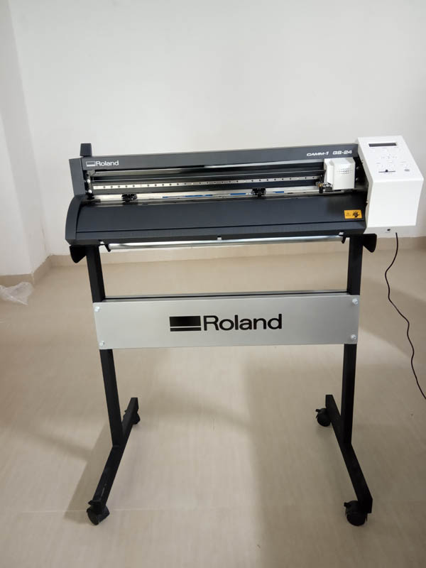

**Vinyl Cutter**

*Roland CAMM-i GS-24*

**designing a sticker**

a simple word "FabZero" was created inside a document sized 150mm by 50mm with 600 dpi using **inkscape** and export it as a png  file 

Next , go to **fabmodules.org** and set Input format as image (.png), then select fabzero.png as input, output format as Roland Vinyl (.camm) , output force (g) as 80 and velocity cm/s as 20.
It is necessary to carefully select the origin.

Next step is to calculate the path and save the file and send it for printing to Roland CAMM-i GS-24

Here is the result. 

*Tips for Loading the vinyl into the printer*

*While loading the Vinyl(The maximum width of vinyl roll is 62 cms.)
Care should be taken to align the vinyl roll parallel to the alignment markings on the cutter.
The rollers can be placed only at the points where there are white markings on the guide 
Further, the rollers can be places at the edge of the vinyl roll by leaving atleast 2mm on both sides*

- [Home](readme.md)
- [3D Printer](3DPrinter.md)