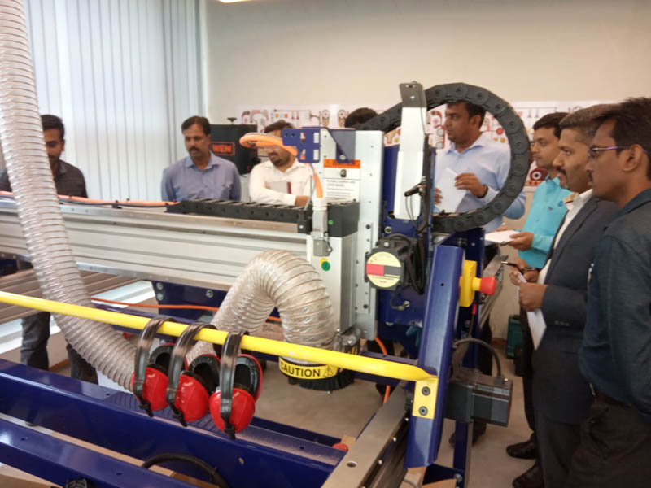

**day 1** : 18th March 2019

After the launch of the training program by the Director General of Software Technology Parks of India through video conferencing, the Fabzero at STPI Bubhaneswar kick started. 
It is learned that STPI is ready to setup new Fablabs across the country if the respective State Government is ready to contribute 50% of the installation cost.
Mr Francisco from Barcelona, Spain, explained the significance of Fablab to the trainers which consists of technical teams from STPI centres across the country.
 The aim of setting up of Fab lab is to expose people from all walks of life such as Startup entrepreneurs, inventors, innovators, students, artists and interested people, to the possibilities of digital fabrication techniques.
One of the aim of Digital fabrication is also to reduce wastage of used articles, if we can create objects of everyday use which can be reassembled into multiple objects.
Fabzero is a precursor to the 6 months diploma program of Fablab. Hoping to learn to make (almost) everything at the Fablab during this session.

Responsibility of the user of Fablab:
To follow all safety instructions 2. At the end of the day, leave the laboratory  and the equipments (clean) just the way you found it 3. To document your experience at the Lab so that others might find it useful.

2.50 PM:	We are going to the newly setup Fab lab at the 1st Floor of (new)  STPI Bhubaneswar building  with our mentors Mr Francisco and Mr Sibu. The trainees were divided into two groups
**Fablab Room no 2**: Mr Sibu explain the working of **Large format CNC machine, Alpha (96X48) by ShopBot**. 
There are basically two types of fabrication process: Additive and Subtractive process, CNC machines are used for Subtractive process
This CNC machine is a three axis milling machine which can work on wood, ply wood, composite materials, soft metal etc but not on steel and other hard metal.
The maximum accuracy of this machine is 1/10 of a millimeter.

**Safety precautions**:1) The operator should always carry the start/stop remote during operation 2) Special care should be taken not to wear loose clothing (including tie) during the operation of this machine. 3) Use of proper air and noise pollution mask is advisable during the operation of this machine.

A **mini bench saw and one scroll saw** for general trimming of wood and other materials is also available in the Lab.

High pressure  water wash is used to washed off substrates and other unwanted residues of a finished product (3D printed objects)

3.36 PM : **Room No 1.** : 

Meet **DGSHAPE SRM20 mini CNC machine**. 
The machine has accuracy of 1/100 mm, while the diameter of smallest drill measures 0.25mm.
Extra care should be taken while handling very small milling tips.

A **Vinyl cutter** can also be used as a Plotter cum Stencil cutter for screen printing 
The cutting tip exerts a max force of 80 grams 

The **Epilog Laser Fusion  M2** is a 75 watt co2 laser cutter which can be used for cutting, engraving and bending  wood, glass etc.

Thin flammable materials, unknown material and material that produce flammable/ poisonous gases on heating should not be used with the laser cutter machine.

A **three stage filter** is used while operating a laser printer for filtering hazardous material and gases.

The lab has three kinds of 3D printers
**Sindoh -3D Wox** is a fused filament disposition type of 3D Printer, thermo plastic is used as printing material.
**Stereo Lithography  3D Printers** There is also another type of 3D printer that uses UV curable resin as the printing material, this type of printer is also known as 
**Strata Sys polyjet (inkjet) printer** is the 3rd type of 3D printer a  use UV curable resin and is capable of printing full colour objects.

4.20 PM: **Back to Training room** 
Created account at git hub by login into  https://github.com/academany/fabzero
Repositories to be uploaded at https://github.com/motilals

[Home](readme.md)
[Day 2-](day2.md)
[Day 3](day3.md)