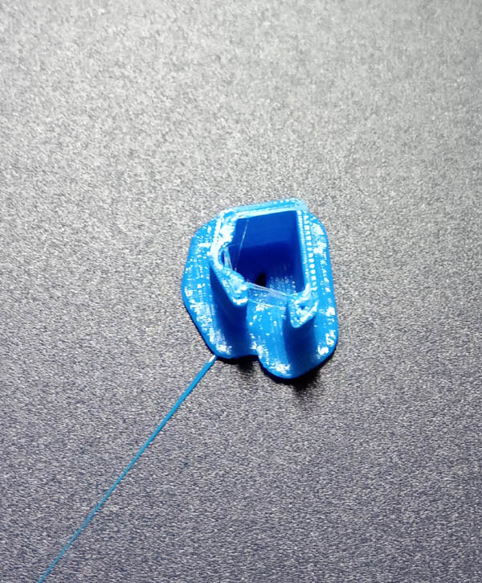

**Day 2**   19th March 2019

The session for the day kick started at 10.00 AM. we were asked to download and install  **"Visual Studio Code"** and after that we install "Code Spell Checker"
We also download and install **"Inkscape"** which is a 2D graphics design software along with **"Cura"** a software for 3D Printing design.

The daily activities that were recorded in our notebooks have to be typed in using "Visual Studio Code" and save it as a markdown file, I have recorded the activities of day one and save it as day1.md and uploaded it in the Repository folder of the github page. It was observed that my page was not displayed correctly, latter,it was realised that it was because it was forgotten to rename the file as **readme.md**, so my day 1 entry is now renamed as "readme.md" 
For ease of working, it is required that a local copy of the uploaded files in Github is created using the following steps.
1. Open Visual Studio Code programme
2. press Ctrl+Shift+P
3. type "git: clone" (better to select the syntax from drop down list), press Enter
4. Open a new window, signin or open your github page and find the "Clone and download" button, and copy the web link of my page from there
5. go to the Visual Studio code program again and paste the page link in the space where  the git: clone command was given. then specify a local folder for storing the files.  
! not working ??? if you are working on Windows operating system, download and install **"Git for windows"** , then restart Visual Studio Basic and try step 2 to step 5 again. (works for me that way)
Now i have a backup of my page in a local folder, the files can now be assessed offline also and edited using Visual Studio Code before uploading the files to the Github page.

**Steps for editing Github page**
1. Open Visual Studio Code, then select and open the file you want to edit 
2. During and after the editing dont forget to save the changes (Ctrl +S), then  click on the "Source Control" button on the left hand side or press (Ctrl + Shift +G)
3. then type a relevant meaningful message regarding the change in the "message box" i have typed 19th March 2019 and then 
4. click on the **commit button** above which is denoted by a "tick sign"
5. The last step to update the page for the Github web is to **push**, for this click on the "button with three dots" and select push. 

**To insert images on the Github pages**
1. select pictures to upload
2. to make sure the images are resized to either 800X600 or 600X800 pixels and are renamed suitably
3. click **explorer** button or Ctrl+ Shift+ E
4. when the cursor is moved over the folder name on the top left side of page  (the folder where the offline pages are stored in the local drive) some pop up icons appear, have to select the **New Folder** button and rename it as **img**
5. the images to be uploaded has to be dumped to this **img** folder by any means, even drag and drop works
6. Bring curser to the desired location within the text and type ****
7. to effect the changes in the Github page follow step 3 to step 5 of previous paragraph.

Have successfully inserted a picture of the Large format CNC Alpha (96X48) ny ShopBot in my day 1 page, using the above steps. more to follow.

Also download **Gitbash** software and update email address and user name by giving the following commands
**git config --global user.email "motilal.sarma@stpi.in"**
**git config --global user.name "Motilals""**

...After the Lunch Break...

**Working on a 3D Printer for the first time**
Picture of a 3D Printer 3DWOX by Sindoh 200 

This printer uses Polylactic acid filament (PLA) for printing objects with different colours, however only a single colour printing can be done at a time 
The filament is 1.75mm in diameter and a cartridge can hold 700 gram of filament
The filament has to be tightly wound, inside the cartridge.
Filament should be handled with care so as not to stressed or bend it to avoid even slight deformities in the filament, any part with deformities may be cut off before feeding inside the printer.

The loose ends of the filament should not extrude from the opening of cartridge.

After new filament cartridge is fitted manually inside the printer, the feed new cartridge command can be assessed by selecting the **Cartridge** menu on lcd screen available in the printer 
(As seen in picture)

a few design files for 3d printing are readily available in the website like **thingiverse.com** for testing, we can create our own designs for printing by using free software like **Curo**

Due to constrain of time, we download a design file for creating a Clip which can be use to prevent unwinding of 1.75mm PLA filament inside the cartridge.

**First 3D printed object**
*a filament clip*

The base substrade had to be removed manually, some bigger designs can be printed without the base.

The printer that we have used is wi fi enabled and the print command can be issued from any pc in the network by using the software provided by the manufacturer or alternatively by transfering the sliced file in G-code format directly to the printer by using a USB memory stick and use the print command from the lcd menu of the printer.

The base plate may get heated up by around 60 degree centigrade, so care should be taken while removing it.

Also, the debri collection chamber inside the printer need to be emptied on regular intervals.

**Vinyl Cutter**

*Roland CAMM-i GS-24*

Hands on for the Vinyl cutter will be done tommorow,
 learned loading the vinyl by adjusting the roller,  for accessibility of maximum area on the vinyl,since the position of two rollers will fix the margin of the cutting head. 

The maximum width of vinyl roll is 62 cms.

Care should be taken to align the vinyl roll parallel to the alignment markings on the cutter.
The rollers can be placed only at the points where there are white markings on the guide 

Further, the rollers can be places at the edge of the vinyl roll by leaving atleast 2mm on both sides

