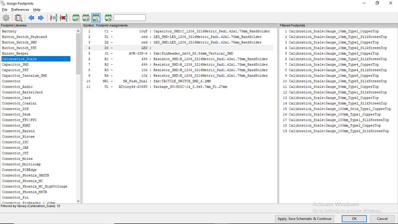
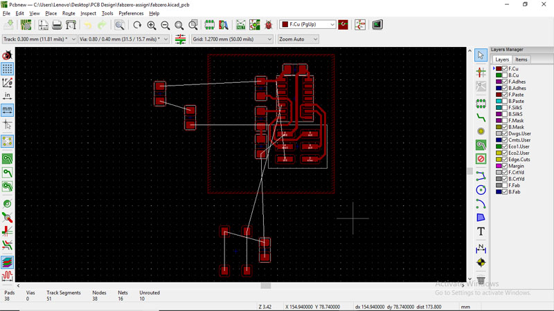
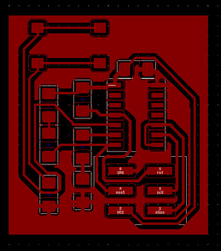
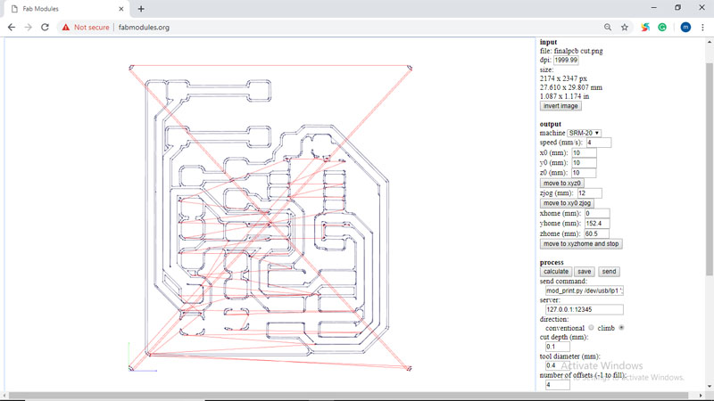
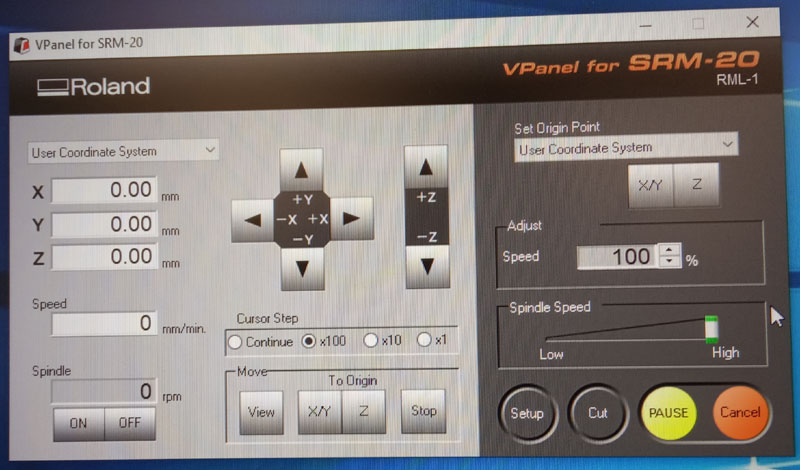
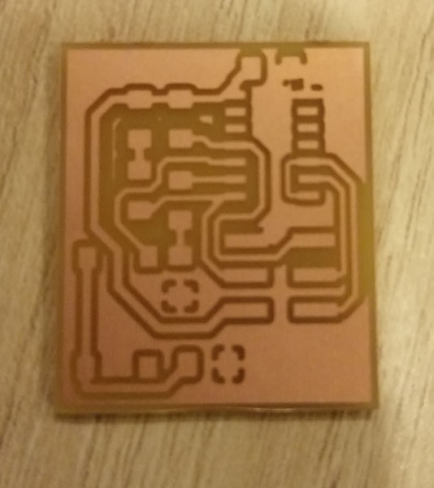
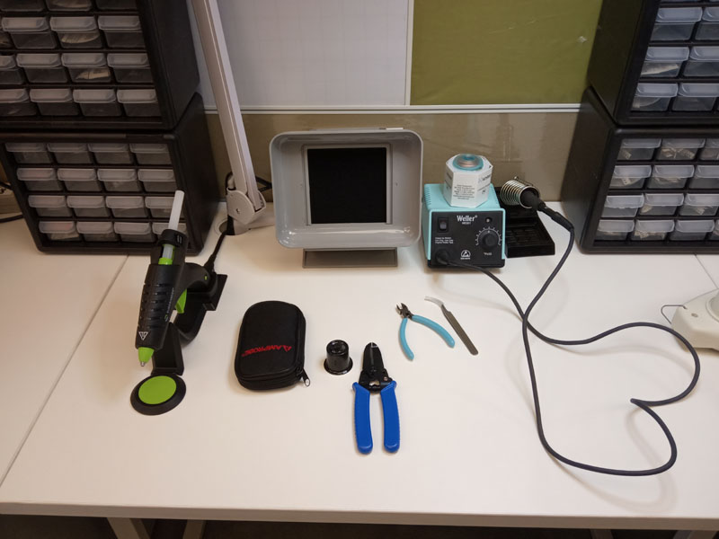
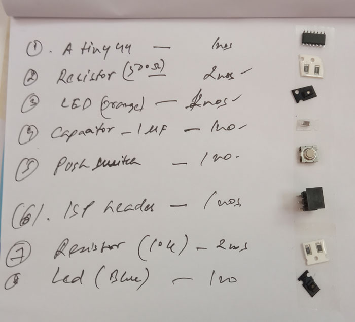
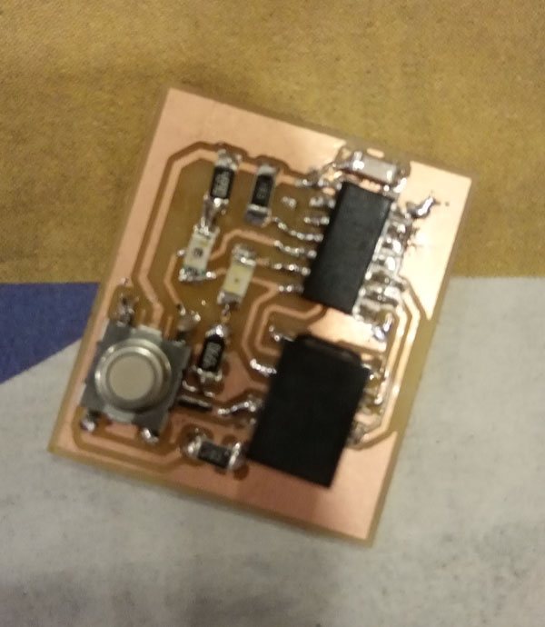

**Design and Fabrication of a programable electronic circuit**

The process  start with designing the Schematic circuit and developing its PCB diagram, then send it for milling. Then, component soldering and programming of Microprocessor, followed by testing.

The first step is to draw a schematic design of the circuit to fabricate using a pcb design software such as **KICAD** 
 

**1. To create a schematic diagram** 
- Open new project in Kicad
- Place components using **place component** tool and by choosing components from dropdown list

*For ease of working*

- **To move component** - place cursor over component and press G
- **To rotate component** - place cursor over component and press R
- **To duplicate component** - place cursor over component and press C
- **To delete component** - place cursor over component and press Del

- Connect components using **green wire icon** (tools on rt. hand)

- *Do not forget to attach a PWR_FLAG to Vcc and GND.*
- *Do not forget to assign a "no connect" symbol for unused pin of an IC.* 

**2. Annotation or Naming**
- Use "Annotate schematic symbols" tool (choose default values)

**3. To Edit Value of Components**
- Move cursor over component + press 'E'  (then type value)

**4. To write a local name / label**
- Use "place Net label" icon 

**5. To Generate Net List**
- Use "Generate Netlist" icon (choose default values)

**6. To Assign foot print**
- Use "Assign PCB footprints to schematic symbols" icon

Refer Pic, 1. Select component type , 2. Select component in schema 3.select footprint 

**7. Resolving Load Errors** 
- most load errors are resolved when connected to Internet
- during offline mode- goto Preference-> Manage Footprint Library
- In PCB library table - Change "Environment variables" under "Library Path" to "Environmental Variables" available in local library.

-To add footprint Library:  Preference> Manage footprint library> add folder containing library

*Everything ok! Time to generate PCB Layout* 

**Tools > update PCB from Schematic** (shortcut - F8 key)

- During route tracking, set track width min. 0.25mm and clearance min. 0.4mm *(File> Board Setup > Net Classes> clearance & track width)*

*Time for the Zig Saw Puzzle* 

- After routing, do not forget to 'perform design rule check'
- Do not forget to copper fill empty zone areas (add fill zones) &
- To draw PCB edge (*select Edge.cut layer and use 'Add graphic line' tool*) 
- Line width of edge is set as 0.8 mm

**Preparing 'PCB trace'  and  'edge cut' files in SVG format**

- Select all and File > Plot 
- plot format - SVG
- Layers - select F.cu and Edge cut
- check - **Negative plot (the circuit path to be in white in B/W image)**
- check - Check Zone fields before plotting
*two SVG files created in the specified folder*

**Preparing files for Roland Mill SR20** 

- Open 'F.cu.SVG' and 'Edgecut.SVG' files in "Inkscape", set dpi = 2000, export as seperate PNG file.

- Open "fabmodules.org" 
- 1. Input format > Image png > select image (either one of svg files) 
- 2. Output > Roland mill (.rml) 
- 3. Process > PCB traces (1/64) - for PCB trace and (1/32) for Edge Cuts, (do not forget to change corresponding milling bids for the two different jobs)
- 4. Output machine > SRM20 
- 5. Other auto filled values may be accepted, *but important to set x0, y0and z0 to 0s respectively otherwise there will be  error! mill head will be offset from PCB*
- 6. Process > calculate (machine path created)
- 7. Save file for sending to Roland SRM20 milling machine

*Repeat the above process for the Edge cut/ trace file.*

**Sending the PCB design for milling**

Open "Vpanel for SRM20" software interface

- 1. Fix PCB to be milled down on a perfectly flat sacrificial bed, using a double sided tape, make sure the PCB is perfectly leveled.

- 2. First set Zero Point, the point on the pcb where the mill head should start operation
- 3. For setting XY axis  zero, move the mill head using the control buttons (+x, _x and _y, +y) then press **XY button** under **Set origin point**.

- 4. *for setting zero point for the Z axis, make sure not to set 'cursor speed in continuous mode'*
- 5. Move down the milling head down near the PCB plate to be milled, then remove the milling bid (*make sure it is 1/64 for tracing and 1/32 bid for cut*), and rescrew it again to the spindle, while pressing down the milling tip on the PCB. 
- 6. Set the zero point of 'Z' axis at this point.
- 7. Press 'cut' button, then select the rml trace file saved earlier using fabmodules.org
- 8. All the best!

*repeat process for the Edge cut file but remember to change milling bid to 1/32 inch, and dont forget to set the new Z axis Zero*.

Now that we have the PCB, 
 

**lets go to the Soldering station.**

- Make a list of components required for the circuit and paste corresponding component against the list using double sided tape.

- Solder the Micro controller first
- then smallest components first

Here is the end product 
 By seer oversight, one of the LED i have chosen is found to be an infrared LED, could see it blinking in a mobile phone camera. Fransisco, suggested that the circuit should be made to control the air conditioning cassette in the Lab.

- 
- 
- 

