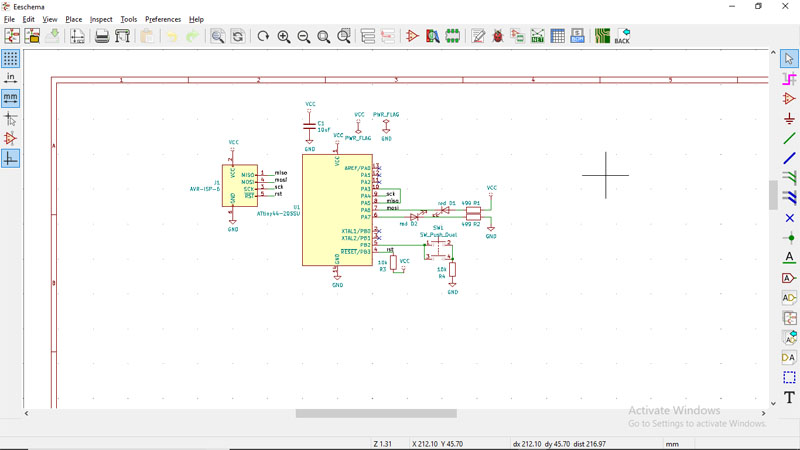

**Design and Fabrication of a programable electronic circuit**
The process will start with designing the electronic circuit and developing its PCB diagram by using **Kicad** software and then send it for milling.

The first step is to draw a schema of the circuit you are going to fabricate using a pcb design software such as **KICAD** 
 
 