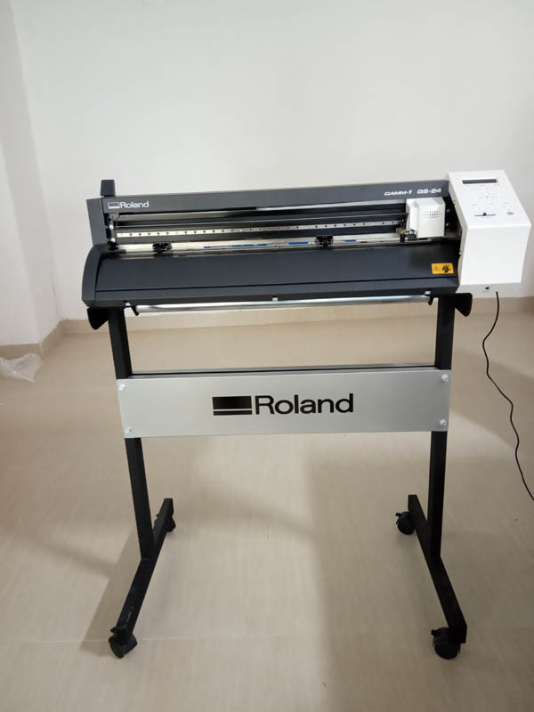
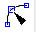
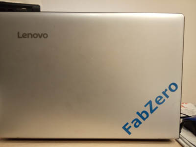

**Vinyl Cutter**

*Roland CAMM-i GS-24*

**Designing a sticker**

There are two ways of creating a sticker design, **Method 1- to create an original image in a graphic design software**, **Method 2- to create an image for sticker, from a photo or a sketch** 

**method 1.** This method is familiar to almost everyone, one can use their favorite graphic design software, the free softwares such as **GIMP or Inkscape** is recommended.
a simple word "FabZero" was created inside a document sized 150mm by 50mm with 600 dpi using **inkscape** and export it as a png  file 

**method 2** 
- If the picture file is a sketch , have to first scan it in digital format such as  jpg
- open file in **inkscape**
- Set Image size (for me setting the document size through File-document properties, and then adjusting the image inside the document by holding Ctrl button to restrain the proportion is easier)
- Select Image then go to Path -> Trace Bitmap (A vectorised black and white image is produced above the original image, (if you dont see original image move the b/W image), and delete the original.
- Now, select remaining B/W image with **node** 
 tool
 - Path - > Stroke to path
 - Export file in **.png** format

**sending file to Roland GS24 Vinyl cutter**
Next , open **fabmodules.org** (alternatively can be done though **mods.cba.mit.edu**)   
- set Input format as image (.png), then select desired file as input, set output format as Roland Vinyl (.camm) , output force (g) as 80 and velocity cm/s as 20. Then, click "process" button and select "cut Vinyl" from the drop down menu. click "Calculate" to set the exact path of the cutter, Pressing the "Save" button will save the file in (.camm) format., which can then be send to the Roland GS-24 Vinyl cutter for cutting.

*It is necessary to carefully select the origin of the cutter head before starting the process and also ascertaining the appropriate pressure of the cutter*

*Tips for Loading the vinyl into the printer*

*While loading the Vinyl(The maximum width of vinyl roll is 62 cms.)
Care should be taken to align the vinyl roll parallel to the alignment markings on output side of the cutter.
The rollers can be placed only at the points where there are white markings on the guide 
Further, the rollers can be places at the edge of the vinyl roll by leaving atleast 2mm on both sides*

Here is the result. 

**Responsibility of the user of Fablab**
To follow all safety instructions 2. At the end of the day, leave the laboratory  and the equipments (clean) just the way you found it 3. To document your experience at the Lab so that others might find it useful.
- [Home](readme.md)
- [3D Printer](3DPrinter.md)
- [documentation tips](documentation.md)